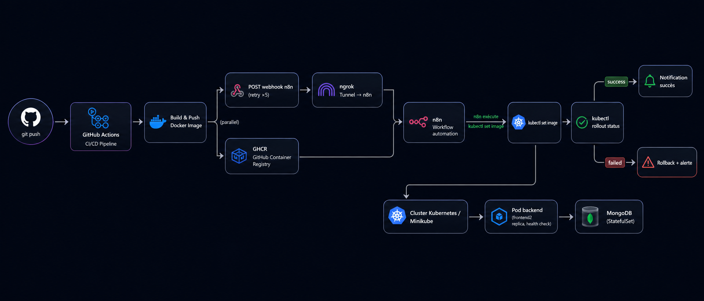
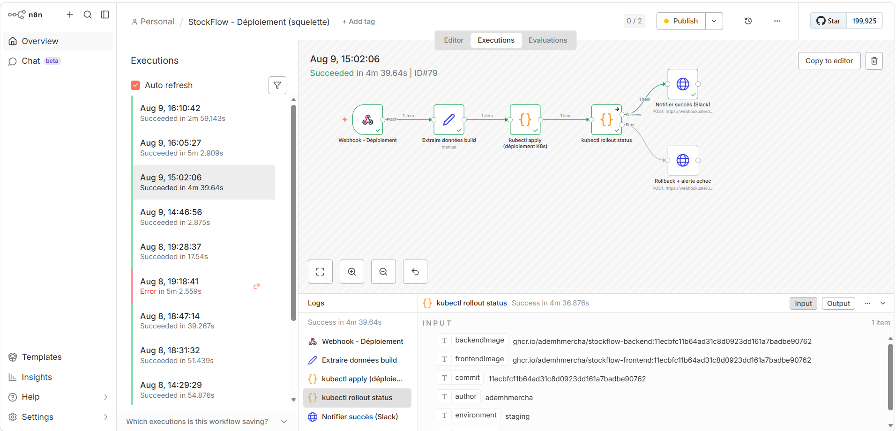

# StockFlow

**StockFlow** est une application SaaS de gestion de stock et de facturation pour les PME/TPE tunisiennes (commerce, distribution, petite industrie), pensée pour remplacer Excel. Elle gère nativement la TVA tunisienne multi-taux (19/13/7%) et le timbre fiscal (montant configurable, car fixé chaque année par la loi de finances).

---

## Partie 1 — Développement de l'application

### Stack

| Domaine | Technologies |
|---|---|
| Frontend | React 18, Vite, TailwindCSS, shadcn/ui, Zustand |
| Backend | Node.js, Express, TypeScript, Mongoose |
| Base de données | MongoDB |
| Auth | JWT (access + refresh), rôles `admin` / `vendeur` / `comptable` |
| PDF | Puppeteer (factures) |
| Tests | Jest + Supertest (52 tests backend), Vitest (frontend) |

### Modèle multi-tenant

Chaque entreprise inscrite est isolée : toute requête backend filtre systématiquement par `entrepriseId`, garanti par une suite de tests dédiée (`tenant-isolation.test.ts`) — une entreprise ne peut jamais lire, modifier ni même détecter l'existence des données d'une autre.

Au-dessus des tenants, une couche **propriétaire de plateforme** (`isPlatformOwner`, jamais accordable via l'API publique) permet de lister toutes les entreprises, voir des statistiques globales, et suspendre/réactiver un compte — avec blocage immédiat de l'accès API en cas de suspension.

### Fonctionnalités clés

- Produits (TVA par produit, alertes de stock), mouvements de stock (entrée/sortie atomiques)
- Clients, factures (calcul HT/TVA/TTC ligne par ligne, timbre fiscal, cycle de vie brouillon → envoyée → payée)
- Dashboard (CA du mois, top produits, alertes stock)
- Pagination sur toutes les listes, rate limiting sur l'authentification (10 tentatives/15 min)

---

## Partie 2 — DevOps : architecture et pipeline

### Vue d'ensemble

Un `git push` sur `main` déclenche un pipeline complet, entièrement automatisé, du build jusqu'au déploiement sur un cluster Kubernetes réel — sans intervention manuelle après le push.



### Détail des étapes

1. **`ci.yml`** — sur chaque Pull Request : lint + tests backend/frontend, bloque le merge si échec.
2. **`deploy.yml`** — sur push vers `main` :
   - build les images `backend`/`frontend` (multi-stage Docker, tag = SHA du commit + `latest`)
   - push vers **GHCR** (GitHub Container Registry)
   - appelle un **webhook n8n** avec le nom des images buildées (`curl --retry 5`, tolère les coupures réseau côté tunnel)
3. **ngrok** expose l'instance **n8n locale** (`localhost:5678`) à une URL publique — c'est le seul pont entre le cloud GitHub et l'environnement de déploiement local.
4. **n8n** (`n8n/workflows/deploy-stockflow-squelette.json`) reçoit le webhook et exécute :
   - `kubectl set image` sur les déploiements `backend`/`frontend`
   - `kubectl rollout status` (timeout 300s, en `exec` asynchrone pour ne jamais bloquer le runner n8n)
   - branche **succès** ou **rollback/alerte** selon le résultat, nativement (pas de node IF manuel)
5. **Kubernetes** (Minikube en local, ou tout cluster cloud en changeant juste l'overlay) : 2 replicas par service, sondes de santé sur `/api/health`, `progressDeadlineSeconds` calibré pour tolérer un premier pull d'image (~1 Go avec Chromium/Puppeteer).


*Exécution réelle du pipeline (environnement staging, succès en 4m 39s) — branchement natif succès/échec, sans node IF manuel.*

### Conteneurisation & orchestration

```
infra/
├── docker/                 # Dockerfiles multi-stage (dev + production)
├── docker-compose.yml       # Environnement de dev local (mongo, backend, frontend, n8n)
└── k8s/
    ├── base/                # Manifests communs (Deployments, Services, Ingress...)
    └── overlays/
        ├── staging/         # Kustomize : namespace, replicas, image tags
        └── production/
```

`docker compose up --build` (depuis `infra/`) lance tout l'environnement de dev avec hot-reload. Voir [infra/k8s/README-k8s.md](infra/k8s/README-k8s.md) pour le déploiement Kubernetes détaillé (Minikube local → cluster cloud).

### Limite connue, assumée

n8n tourne en local et est exposé via un tunnel ngrok gratuit — pratique pour développer/démontrer le pipeline sans louer de serveur, mais l'URL est éphémère et la machine doit rester allumée. Pour une vraie prod, n8n serait hébergé sur un serveur dédié (ou n8n Cloud) avec une URL fixe.

---

## Démarrage rapide

```bash
cp .env.example infra/.env
cd infra && docker compose up --build
```

| Service | URL |
|---|---|
| Frontend | http://localhost:5173 |
| Backend | http://localhost:4000/api |
| n8n | http://localhost:5679 |

```bash
curl http://localhost:4000/api/health   # {"status":"ok","db":"connected"}
cd apps/backend && npm test              # 52 tests
cd apps/frontend && npm test             # tests frontend
```

## Rôles utilisateurs

| Rôle | Accès |
|---|---|
| `admin` | Accès complet à son entreprise |
| `vendeur` | Produits, stock, clients, factures |
| `comptable` | Clients, factures, dashboard (lecture seule sur les produits) |
| Propriétaire de plateforme | Panneau `/admin` — toutes les entreprises, tous tenants confondus |
